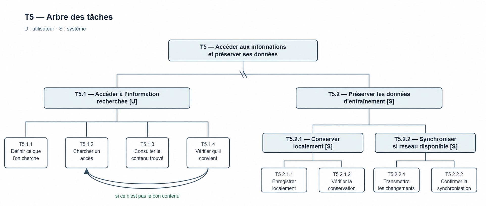

# T5 — Accéder aux informations et préserver ses données

**Responsable :** Sami · **Statut :** synthèse proposée, à valider en réunion.

## Vue d’ensemble

**But :** permettre à l’utilisateur d’accéder à l’information recherchée tout en assurant la conservation et la synchronisation de ses données d’entraînement.

**Acteurs :** `U` : utilisateur · `S` : système.

## Schéma de l’arbre des tâches

## Relations temporelles

- **T5.1 :** définir l’information recherchée → chercher un accès → consulter le contenu trouvé → vérifier qu’il convient.
- Si le contenu ne convient pas, reprendre à **T5.1.2 Chercher un accès**.
- **T5.2.1 :** enregistrer localement → vérifier la conservation.
- **T5.2.2 :** si le réseau est disponible, transmettre les changements → confirmer la synchronisation.
- La conservation locale permet de préserver les données avant leur éventuelle synchronisation.
