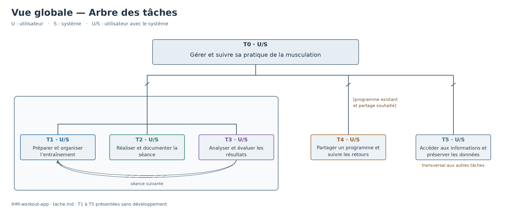
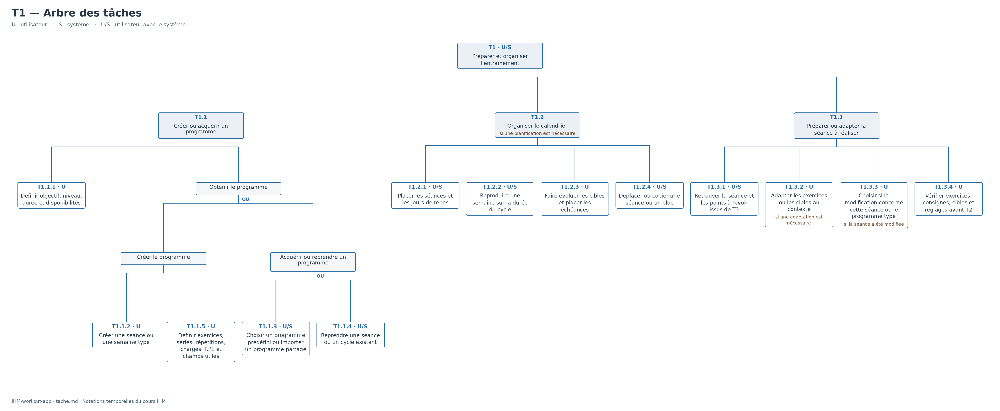
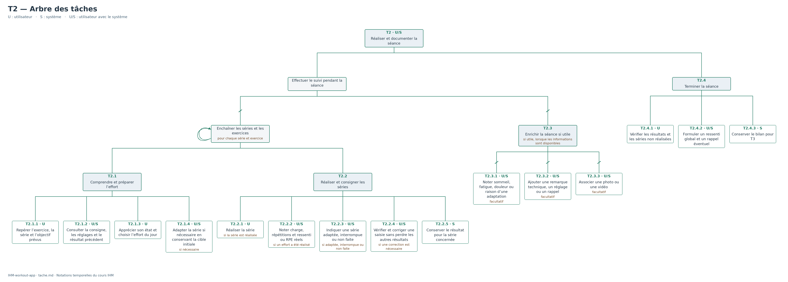
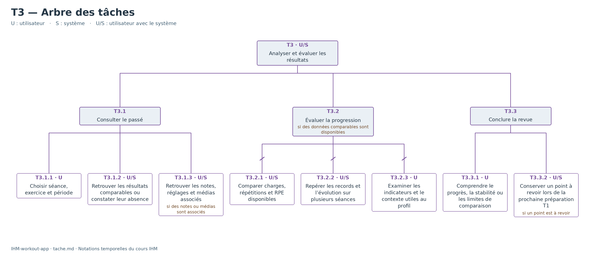
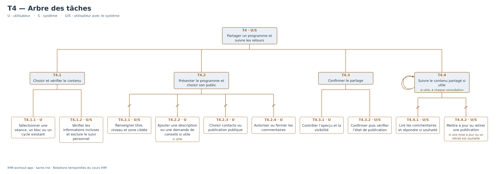

# Arbres des tâches — Musculation

Les schémas ci-dessous présentent la vue globale et le détail de T1 à T4. T5 reste dans la vue globale ; son schéma existant est conservé.

## Vue globale

## T1 — Préparer et organiser l’entraînement

## T2 — Réaliser et documenter la séance

## T3 — Analyser et évaluer les résultats

## T4 — Partager un programme et suivre les retours

## Lecture des schémas

- Embranchement sans barre : séquence de gauche à droite.
- Embranchement barré : suite sans ordre imposé.
- « OU » : choix entre les branches.
- Double arc relié aux tâches : répétition ; retour de T3 vers T1 pour la séance suivante.
- Les conditions précisent quand une tâche est exécutée.

Les libellés sont issus de [l’arbre consolidé tache.md](https://github.com/fergouchyahya/IHM-workout-app/blob/main/docs/04-analyse-taches/tache.md). Des regroupements permettent de représenter les alternatives et les répétitions.
